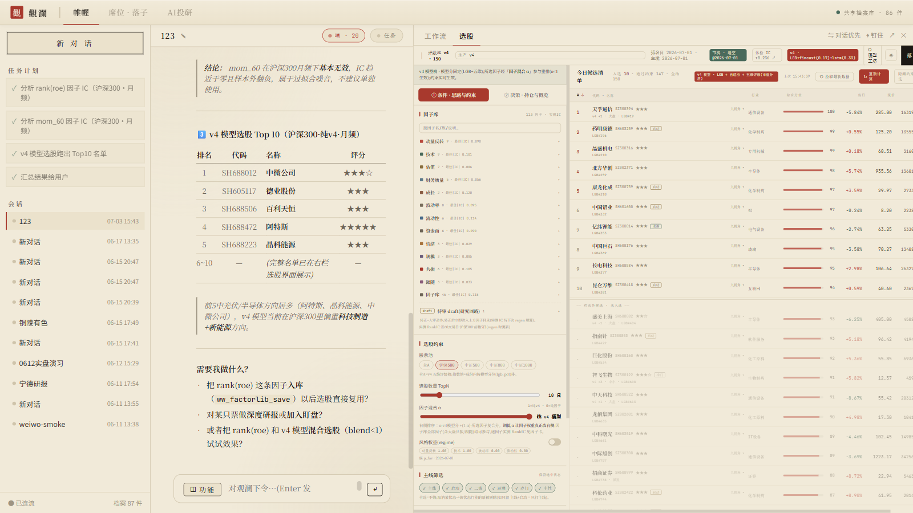
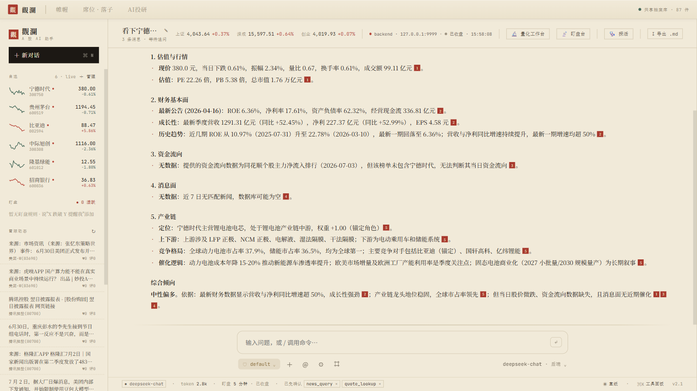
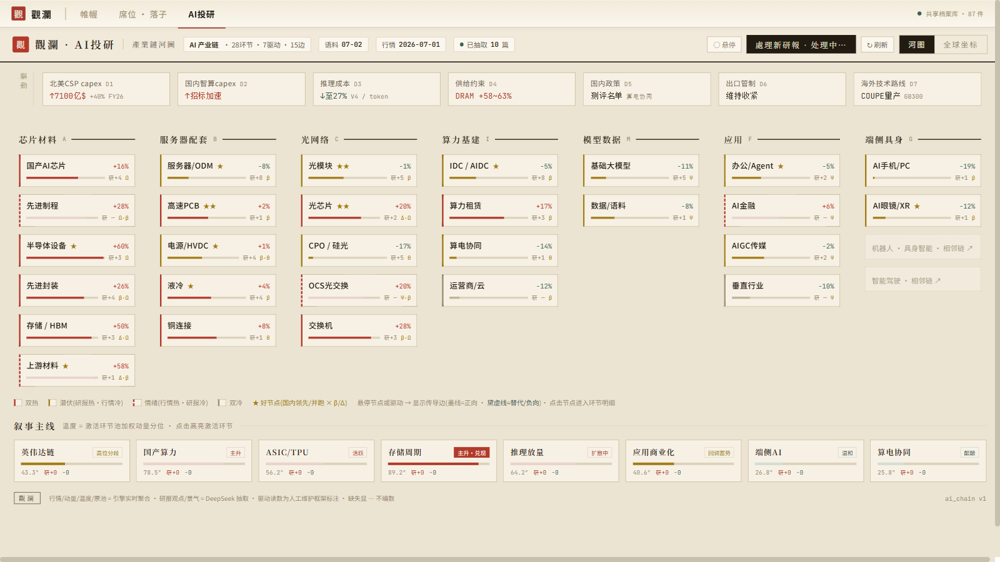
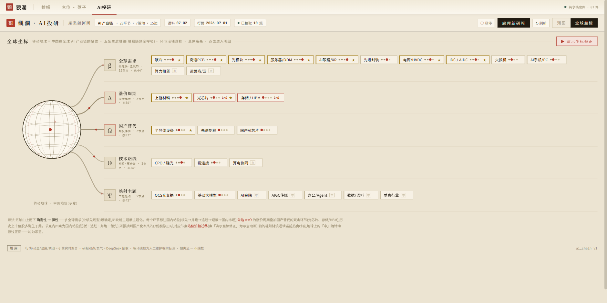
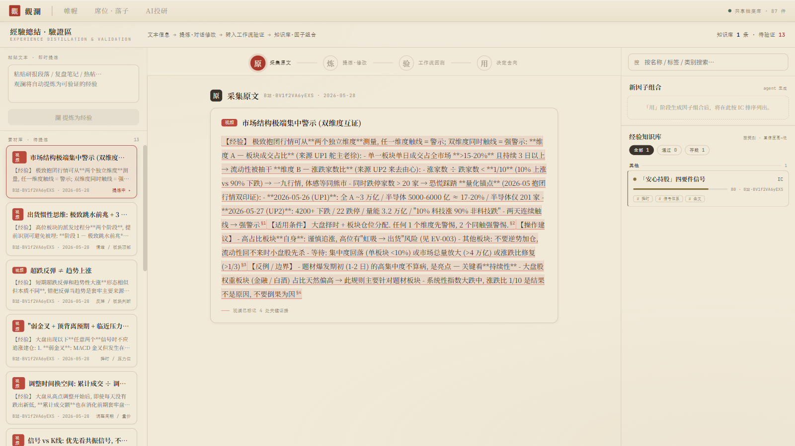
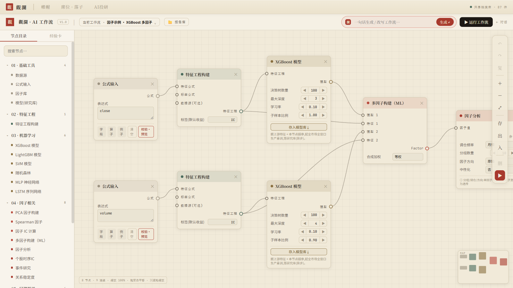
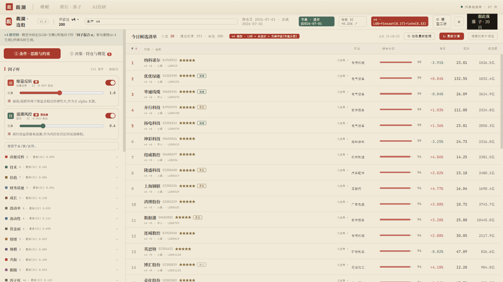
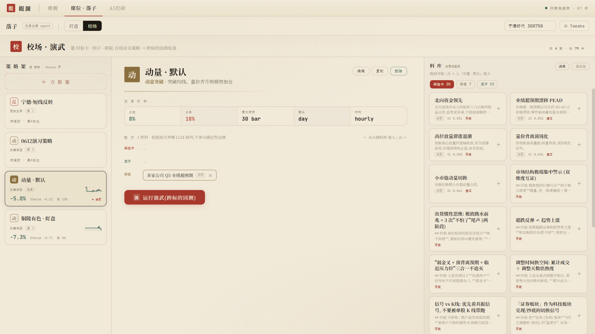
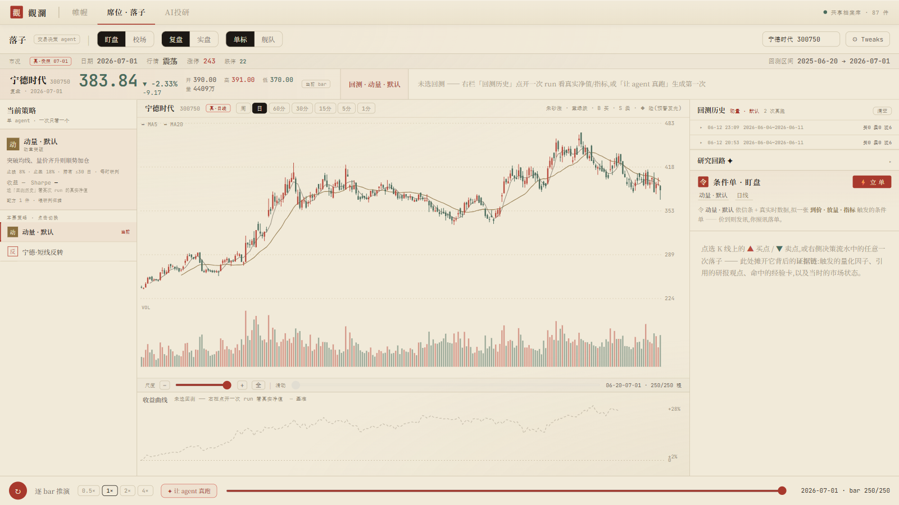
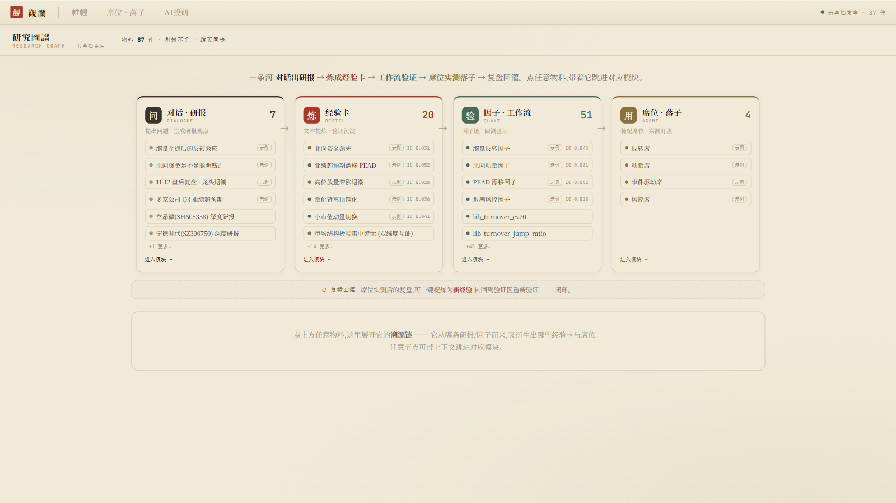

<p align="center">
  
</p>

<p align="center">
  <h1 align="center">觀瀾 · Financial Analyst</h1>
</p>

<p align="center">
  <strong>A 股「研究 → 交易」一体化研究工作台 —— 由一个 agent 总控</strong>
</p>

<p align="center">
  <em>对话研报 · 产业链看板 · 因子选股 · 工作流 · 经验卡 · 席位落子 —— 七个研究模块在同一个本地档案库里流转成闭环,<br>「帷幄」agent 在其上一句话总控;底层一套 vendored <code>financial_analyst</code> 引擎(24 智能体 / 440+ alpha 因子 / 4 信任层级)供给真数据。</em>
</p>

<p align="center">
  
  
  
  <br>
  
  
  
  
  
  
</p>

<p align="center">
  <a href="#-是什么">是什么</a> &nbsp;·&nbsp;
  <a href="#-凭什么值得一看">亮点</a> &nbsp;·&nbsp;
  <a href="#-界面--走一圈">界面截图</a> &nbsp;·&nbsp;
  <a href="#-研究闭环--八模块">八模块</a> &nbsp;·&nbsp;
  <a href="#-快速开始">快速开始</a> &nbsp;·&nbsp;
  <a href="#-架构三层">架构</a> &nbsp;·&nbsp;
  <a href="#-设计红线">设计红线</a>
</p>

> ⚠️ **个人研究工作台,非开箱即用的产品**。运行需要一份本地 A 股数据(日线 / 新闻 / 因子),默认指向作者机器上的数据目录,需经 `config/loaders.yaml` 或环境变量改指到你自己的数据。引擎已 vendored 进仓库 `engine/`,**自包含**;仅数据外部、且不随仓库分发。

---

## 💡 是什么

**一个像买方分析师一样思考的 A 股研究工作台。** 把一套经过验证的 `financial_analyst` 引擎(行情 / 资金流 / 新闻 / 研报 / 因子 / 盯盘)包成中式克制风格的多模块前端;研究到交易拆成一条流水线,用一个共享的本地档案库串成闭环,再交给一个 agent 总控。

底层引擎按 **4 个信任层级**编排智能体(数据 → 分析 → 决策辩论 → 自审):研报「评级 / 归因 / 可证伪」,只有 `report-writer` 能落盘,Tier-1 不可信源(新闻 / F10)JSON-schema 锁死防注入。记忆是 markdown —— 改一个 `.md`,下一篇研报就用上。

<p align="center">
  
</p>

---

## ✨ 凭什么值得一看

- **🎛 一句话指挥整个工作台** —— 「帷幄」单 agent · 69 工具:选股、跑研报、装策略、开盯盘全在对话里完成;还有一条自主研究回路(提案 → 求值 → 过闸 → 批判),agent 自己炼因子、自己验证、过闸才转正。
- **📏 因子不靠拍脑袋** —— 选股因子库 113 个,逐个**实测 IC** 明示在界面上;经验卡把口头盘感炼成 DSL 表达式、单因子回测过闸才入库;MACD / RSI / KDJ / BOLL 等 TA 族用引擎算子重建,全部实测通过后注册。
- **🤖 选股是模型融合的** —— v4 LightGBM 排序 + FinCast / LSTM 深度模型 z 混合 + regime 风格权重;模型工坊里可自选因子训练 v4 变体,体检对比后上岗。
- **🗺 产业链看板由 LLM 喂养** —— 研报批量抽取观点 / 驱动 / 景气(带引用校验防编造),28 环节河图 + 全球坐标双视图,叙事主线带温度分位。
- **🧾 诚实是硬约束** —— 查不到就写「无数据」,绝不编;一切降级显形(⚠ / 旧 n 日徽章);非 LLM 结果绝不冒充 LLM 研判;不接券商、无真下单通道。
- **🧱 工程极简自包含** —— 无构建 React 18(8 个页面、0 行构建配置),FastAPI 薄壳 + vendored 引擎,一条命令起全站;另带 48 工具的 MCP server,外部 agent / IDE 可遥控整个工作台。

---

## 🖥 界面 · 走一圈

> 以下截图全部来自本机真实运行(2026-07):真数据、真回测、真 agent 输出,没有一张摆拍 mock。

**🎛 帷幄 —— 对观澜下令,agent 拆解执行**
左栏任务计划逐项打勾,中间给出研判结论(因子 IC 分析 + v4 选股 Top10),右栏直接把选股界面开出来接着干活。

<p align="center">
  
</p>

**💬 对话 · 研报 —— 问一只股票,答一份研判**
agent 串起估值 / 财务 / 资金 / 消息 / 产业链五段分析,句句带证据角标可溯源;查不到的资金流向,直接写「无数据」—— 不编。

<p align="center">
  
</p>

**🗺 AI投研 · 河图 —— 产业链的一张活地图**
AI 产业链 28 环节 × 7 驱动 × 15 传导边:行情 / 动量 / 温度实时聚合,研报观点由 LLM 批量抽取,底部叙事主线带温度分位。

<p align="center">
  
</p>

**🌐 AI投研 · 全球坐标 —— 换个投影看同一条链**
五条主逻辑轴(全球需求 β / 涨价周期 Δ / 国产替代 Ω / 技术路线 Θ / 映射主题 Ψ),环节按国内站位挂轴,轴粗细随热度呼吸。

<p align="center">
  
</p>

**🃏 经验卡 —— 把口头盘感炼成可回测的因子**
粘贴一段复盘笔记 / 研报段落,走「原 → 炼 → 验 → 用」四段流水:关键证据自动高亮,LLM 炼成 DSL 表达式,回测过闸才进知识库。

<p align="center">
  
</p>

**🧪 AI 工作流 —— 节点画布搭因子流水线**
数据源 → 特征工程 → XGBoost / LightGBM / SVM / 随机森林 / MLP / LSTM → 多因子构建 → IC / 回测;顶栏一句话生成整条工作流。

<p align="center">
  
</p>

**🔎 选股 —— 113 个实测 IC 因子 + 模型融合排序**
左栏因子库逐族列实测 IC,v4 模型 + FinCast / LSTM 融合打分出今日候选(五维评级 + 主线标签),右上一键「据此落子」。

<p align="center">
  
</p>

**⚔ 席位 · 校场 —— 用研究物料装配策略,跨标验真**
把经验卡 + 因子 + 研报拖进配方,装成自命名策略,跨标的回测验真;亏了就亏了,-5.8% 照样挂在策略架上。

<p align="center">
  
</p>

**♟ 席位 · 盯盘 —— 单票作战位,逐 bar 推演**
真 K 线(朱砂涨 / 黛绿跌)+ 回测历史 + 条件单 + agent 研判一屏收齐,底部逐 bar 推演重放每一次决策。

<p align="center">
  
</p>

**🕸 研究图谱 —— 全库物料的溯源总览**
对话出研报 → 炼成经验卡 → 工作流验证 → 席位实测落子 → 复盘回灌;点任意物料展开它的溯源链,带上下文跳进对应模块。

<p align="center">
  
</p>

---

## 🔄 研究闭环 · 八模块

```
研报/看板(research) → 炼因子(factor) → 验证成经验卡(card) → 装配成席位(seat) → 落子/复盘(decision)
      ↑                                                                          │
      └───────────────────────── 复盘回灌:提炼新经验卡 ←────────────────────────┘
                     「帷幄」agent 在整条链路上方总控(对话即操作)
```

| 模块 | 路径 | 职责 |
|---|---|---|
| 🎛 帷幄 | `ui/console/` | agent 总控台:对话即操作,44 专属工具 + 25 引擎研究工具,自主研究回路 |
| 💬 对话 · 研报 | `ui/chat/` | 流式研究助手:多步工具链 + 深度研报,证据角标可溯源,可导出 md |
| 🗺 AI投研 | `ui/industry/` | AI 产业链看板:河图 / 全球坐标双视图,研报 LLM 批量抽取喂养 |
| 🔎 选股 | `ui/screen/` | 113 因子(实测 IC)+ v4/DL 融合排序 + 约束筛选,票池分层评级 |
| 🧪 因子 · 工作流 | `ui/factor/` | 节点画布:数据源 / 特征工程 / ML(XGB·LGBM·SVM·RF·MLP·LSTM)/ IC / 向量化回测 |
| 🃏 经验卡 | `ui/cards/` | 文本经验 → LLM 精炼 → DSL 因子 → 单因子回测验证 → 沉淀方法论 |
| ♟ 席位 · 落子 | `ui/seats/` | 校场装配策略 + 跨标回测;盯盘逐 bar 推演 + 条件单 + agent 研判 |
| 🕸 研究图谱 | `ui/graph/` | 共享档案库总览 + 溯源链,跨模块 `GL.handoff` 带上下文跳转 |

物料带 `refs` 互相引用构成研究闭环的图。后端自有因子库 `guanlan_v2/factorlib/`:价量 + 财务 + **TA 指标族**(MACD / RSI / KDJ / BOLL / WR,用引擎 `sma`=EMA 等算子重建,经 `/factor/report` 实测后注册进引擎 zoo)。

---

## ⚡ 快速开始

```bash
# 需 Python 3.13
git clone https://github.com/jesson-hh/financial-analyst.git
cd financial-analyst
pip install -e .                  # 装依赖(引擎已 vendored 在 engine/,运行期上 sys.path)

cp .env.example .env              # 填 DEEPSEEK_API_KEY(研报综述 / 经验卡精炼 / 盘中研判用)
# 数据目录:改 config/loaders.yaml 或设环境变量,指向你自己的 A 股数据(日线 / 新闻);
# 默认指向作者本地路径,不改则数据相关端点不可用。

python -m guanlan_v2.server       # 起服务(自带服务静态前端)
# 浏览器开 http://127.0.0.1:9999/ui/  → 帷幄总控台
```

- 引擎源默认 = 仓库内 `engine/`;配置默认 = 仓库内 `config/`(deepseek `llm.yaml` + `loaders.yaml`)。
- 数据经单入口 `financial_analyst.data.paths.get_data_paths()` 解析(env > `loaders.yaml` > 本地 fallback);盘中实时行情走引擎内腾讯实时源。
- `GUANLAN_FA_SRC` 可覆盖引擎源做 A/B。

---

## 🏗 架构(三层)

```
前端   ui/<module>/*.html + *.jsx     无构建,浏览器内 Babel 即时编译 JSX(8 页面)
  └─ 共享 _shared/ (设计 tokens / 全局导航 / 档案库总线 / 共用组件)
后端壳  guanlan_v2/server.py           FastAPI:import 引擎 build_app() + guanlan 自有路由 + 静态前端
  ├─ /gl-mcp                          guanlan MCP server(48 工具 · HTTP + stdio 双传输 · 写操作默认锁)
  └─ /mcp                             引擎自带 MCP(20 研究工具)
引擎   engine/financial_analyst        24 agents · 4 信任层级 · 440+ alpha;数据经 get_data_paths 只读引用
```

- **无构建前端**:无 webpack / vite / node_modules;每页独立 HTML 引 React 18 UMD + `@babel/standalone` 浏览器内编译。多页 + 整页导航(非 SPA)。改完刷新即生效(改 jsx 后 bump HTML 的 `?v=` 缓存串)。
- **薄壳后端**:`server.py` 把引擎 `build_app()`(全部真实端点)+ guanlan 自有路由(`/cards/*` · `/seats/*` · `/factorlib/*` · `/screen/*` · `/industry/*` · workflow 节点)缝起来并服务静态前端。
- **档案库总线**:`ui/_shared/guanlan-bus.js` 的 `window.GL`(localStorage 持久化)是各模块唯一事实源。

详见 [ARCHITECTURE.md](ARCHITECTURE.md) · [docs/module_map.md](docs/module_map.md) · [docs/dev_guide.md](docs/dev_guide.md)。

---

## 📐 设计红线

**产品诚实(硬规则,贯穿所有模块)**

- **无真值必降级、降级必显形** —— 数据断供 / 陈旧 / 缺失,界面上打 ⚠ 或「旧 n 日」徽章,绝不拿旧数据冒充新鲜。
- **LLM 与非 LLM 泾渭分明** —— 规则扫描产生的信号必带「非 LLM」徽章,绝不冒充 agent 研判;LLM 失败就是失败,不静默兜底。
- **抽取防编造** —— 产业链看板的研报观点抽取带原文引用校验,对不上的丢弃。
- **无真下单** —— 研究平台不接券商,MCP 不暴露下单工具;产出是供复核的分析底稿。

**仓库纪律**

- **数据只引用不复制** —— 行情 / 新闻数据留外部,经 `get_data_paths` 只读引用。
- **密钥不入库** —— 真 `.env` 不提交;引擎从环境读 key(见 [.env.example](.env.example))。
- **运行态不入库** —— 研判记录 / 台账 / 验证产物 / 生成研报 / 大数据 artifact 留本地(见 [.gitignore](.gitignore))。

---

## 🧰 技术栈

- **后端**:FastAPI 薄壳 + vendored `financial_analyst` 引擎(Python 3.13)
- **前端**:无构建 React 18(UMD)+ `@babel/standalone`;中式视觉 —— 宣纸暖白 / 月夜深墨、朱砂红(涨)/ 黛绿(跌)/ 印章红、Noto Serif/Sans SC + JetBrains Mono、品牌符号「觀」印
- **LLM**:deepseek 为主(对话 / 研判 / 经验卡精炼),行业研报批量抽取走 Kimi;key 全部从环境读,绝不入库
- **量化**:LightGBM 排序模型 + FinCast / LSTM 深度模型融合、regime 风格权重、实测 IC / vintage IC(OOS 闸)、PIT 纪律、CSCV/PBO 过拟合检验
- **数据**:A 股日线 / 新闻 / 因子,只读引用(几十 GB,不随仓库分发)

---

## 📄 License

Apache-2.0 · **仅研究 / 教育用途**。产出为供合格专业人士复核的分析底稿,不构成投资建议、不执行交易、不向任何账本下单。© [@jesson-hh](https://github.com/jesson-hh)
