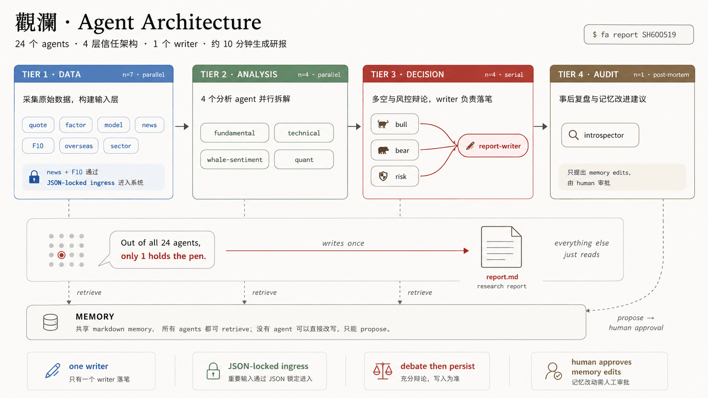

<p align="center">
  
</p>

<p align="center">
  <h1 align="center">觀瀾 · Financial Analyst</h1>
</p>

<p align="center">
  <strong>One command. 24 AI agents. A 股深度研究.</strong>
</p>

<p align="center">
  <em>Turn a 6-digit stock code into a 16-agent deep-dive report — fundamentals · technicals · whale signals · quant scores · bull/bear/risk debate — in ~10 minutes.</em>
</p>

<p align="center">
  <strong>English</strong> &nbsp;·&nbsp; <a href="README_zh.md">中文</a>
</p>

<p align="center">
  <a href="https://pypi.org/project/financial-analyst/"></a>
  
  
  
  
  <br>
  
  
  
  
  
  <a href="https://huggingface.co/yifishbossman"></a>
</p>

<p align="center">
  <a href="#-what-is-it">What is it</a> &nbsp;·&nbsp;
  <a href="#-key-features">Features</a> &nbsp;·&nbsp;
  <a href="#-quick-start">Quick Start</a> &nbsp;·&nbsp;
  <a href="#-the-24-agents">Agents</a> &nbsp;·&nbsp;
  <a href="#-pluggable-memory">Memory</a> &nbsp;·&nbsp;
  <a href="#-datasets">Datasets</a> &nbsp;·&nbsp;
  <a href="#-llm-providers">LLM</a>
</p>

🐣 **New to Python / CLI?** **[小白上手指南 (中文, 30 min) →](docs/setup/beginner_zh.md)**

<p align="center">
  
</p>

```bash
pip install financial-analyst==1.0.7    # 1 minute, no [serve] flag needed
fa start                                 # zero-config: wizard + backend + web UI + browser auto-opens
```

> **🆕 v1.0.7 highlights** *(2026-05-26)*
>
> - **`fa data update` 全开 5 种新数据** — `--include-f10` (TDX 公司大事/龙虎榜/研究报告, 零 token, pytdx 直连) · `--include-concepts` (同花顺概念股 + 成分股, 零 token, adata) · `--include-northbound` (沪+深股通历史资金流向, 零 token, akshare) · `--include-financial` (Tushare 财务三表, opt-in) · `--include-stock-basic` (Tushare 公司基本信息, opt-in)
> - **UI 数据按钮 Shift+点击全开** — 普通点击 = 日线 + 5min + daily_basic + 北向 (~5 min 安全); Shift+点击 = 全开 (+ F10 csi500 ~30 min + 概念股 + Tushare 两项)
> - **buddy `/data/refresh` 7 个 query 跟 CLI 一一对齐** — UI 一键映射 CLI flag, Tushare token 走 server env `FA_TUSHARE_TOKEN` 不在 URL 暴露
> - **`last_update.py` 扩 8 个数据类型** — `/data/status` 现在追踪 day/5min/daily_basic/financials/f10/concepts/stock_basic/northbound 8 类 staleness
> - **3–10× faster data downloads** (v1.0.6 起) + **ModelScope (魔搭) CN-CDN** (`FA_DATA_SOURCE=modelscope`)
>
> Full [CHANGELOG](CHANGELOG.md).

---

## 💡 What Is It

**A-share research workstation that thinks like a buy-side analyst.**

Hand it a stock code; 14 specialized AI sub-agents run in 4 trust tiers:

<p align="center">
  
</p>

Out comes a markdown research report — **rated, attributed, falsifiable**. The `report-writer` is the **only** agent allowed to write report files. Untrusted news/F10 sources are JSON-schema-locked at Tier-1 (no prompt injection). Memory is markdown — edit a `.md`, next report uses it. FTS5 retrieval cuts prompt cost ~60%.

---

## 🎬 See it in action

<table>
<tr>
<td width="50%" valign="top" align="center">

**💻 CLI** — `fa report SH600519` end-to-end

<video src="https://github.com/jesson-hh/financial-analyst/raw/main/docs/demo/cli.mp4" controls width="100%" muted></video>

</td>
<td width="50%" valign="top" align="center">

**🖥 Web UI** — 觀瀾 dashboard interaction

<video src="https://github.com/jesson-hh/financial-analyst/raw/main/docs/demo/ui.mp4" controls width="100%" muted></video>

</td>
</tr>
</table>

> Videos don't play in your viewer? Direct download:
> [cli.mp4](docs/demo/cli.mp4) · [ui.mp4](docs/demo/ui.mp4)

---

## ✨ Key Features

<table>
<tr>
<td width="50%" valign="top">

### 🎯 16-agent stock deep-dive
- Full research report in ~10 min
- Fundamentals · technicals · whale · quant
- Bull / bear / risk debate → `report-writer` synthesizes
- Tier-4 introspector self-audits
- **Only `report-writer` writes files**

```bash
fa report SH600519
```

</td>
<td width="50%" valign="top">

### 🌅 Morning brief (5-agent v2)
- Overnight US + HK + VIX scan
- A-share 异动 + catalyst extraction
- Sector rotation
- AI-written summary

```bash
fa brief
```

</td>
</tr>
<tr>
<td width="50%" valign="top">

### 🌍 Overseas radar (v1.9.7)
- SPX / NDX / HSI / VIX / USDCNY transmission
- → A-share follow-through judgment
- Actionable signals for tomorrow

```bash
fa overseas-radar
```

</td>
<td width="50%" valign="top">

### 📈 Monthly mainline radar
- 5-state industry-chain classifier
- mainline / initiation / revival / decay / cold
- `init → mainline` golden: +5.54pp fwd_60d, 87% win

```bash
fa mainline
```

</td>
</tr>
<tr>
<td width="50%" valign="top">

### 🧠 Pluggable memory
- 24 per-agent memory dirs as markdown
- Edit `risk-officer/hard_rules.md` → next report respects it
- No code change, no restart
- `_shared/playbook_V1_V10.md` cross-agent

</td>
<td width="50%" valign="top">

### 💤 Dream loop (self-improving)
- After each report, `introspector` flags issues
- Aggregator clusters proposals → `_proposed/`
- **No auto-merge** (errors compound in quant)

```bash
fa dream --since 30
```

</td>
</tr>
<tr>
<td width="50%" valign="top">

### 🔌 4-provider LLM routing
- `qwen` — domestic direct
- `deepseek-chat / -reasoner` — Clash + MITM
- `openai` · `anthropic`
- Per-provider network profile, no fake-ip hijack

```bash
financial-analyst    # /model deepseek-reasoner
```

</td>
<td width="50%" valign="top">

### 🧬 BYOM extensibility
- Drop a `.py` into `config/plugins.yaml`
- Your private model joins the quant consensus
- **Your checkpoints never enter the open-source repo**
- See [examples/](examples/) — FM cluster / CSV loader / TDX F10

</td>
</tr>
</table>

---

## 🔌 MCP integration

**20 fa tools accessible from any AI IDE that speaks the [Model Context Protocol](https://modelcontextprotocol.io/).**

- **stdio** — `financial-analyst-mcp` console script auto-installed by pip. Works with Claude Desktop, Claude Code.
- **HTTP streamable** — `fa start` auto-mounts the same tools at `http://127.0.0.1:9999/mcp`. Works with Cursor, Codex CLI, JetBrains AI plugins.
- **Same 20 tools, two transports** — read (`quick_quote`, `memory_search`, `read_past_report`, `chain_lookup`, ...) <1s; long (`report`, `data_update`) covered by the `read_past_report` workaround; **dream-loop mutation tools** (`accept_proposal`, `revert_proposal`) write to `~/.financial-analyst/audit.jsonl` and `git add` the change so every memory edit is observable and reversible.

Full client config for all 4 IDEs → **[docs/mcp.md](docs/mcp.md)**

---

## ⚡ Quick Start

### A. PyPI (recommended, 1 minute)

```bash
pip install financial-analyst==1.0.7
fa start                   # interactive wizard (LLM key + workspace + HF dataset)
                           # then auto-starts backend + UI + browser
# or non-interactive:
fa init --yes --preset demo --workspace D:/fa-workspace   # CI / scripted
fa report SH600519                                         # first deep-dive (~10 min)
```

### B. Source (development)

```bash
git clone https://github.com/jesson-hh/financial-analyst.git
cd financial-analyst
pip install -e ".[dev]"
pytest tests/              # 712 tests, ~8 min
```

---

## 🤖 The 24 Agents

| Tier | Agents | Role |
|---|---|---|
| **Tier 1** (data) | quote-fetcher · factor-computer · model-predictor · **news-reader** · **f10-reader** · overseas-market-scanner · sector-rotation-analyzer | Parallel fetch + factor + read untrusted (JSON-schema-locked) |
| **Tier 2** (analysts) | fundamental · technical · whale · quant | Per-perspective structured analysis |
| **Tier 3** (decision) | bull-advocate · bear-advocate · risk-officer · **report-writer** | Debate then synthesize (only writer can persist) |
| **Tier 4** (audit) | introspector | Post-mortem self-audit + memory proposals |
| **Market** | market-scanner · morning-brief-writer · catalyst-extractor (v1.9.7) · global-news-aggregator (v1.9.7) · macro-impact-analyzer (v1.9.7) · mainline-classifier · mainline-writer · intraday-reviewer | Cross-stock and macro pipelines |
| **Meta** | ask | Free-form Q&A via tool chain (31 buddy tools) |

Full DAG: [docs/architecture/14_agents.md](docs/architecture/14_agents.md)

---

## 🧠 Pluggable Memory

```
memories/
├── README.md                        # ← directory index, must-read
├── risk-officer/
│   ├── hard_rules.md                # ← edit this → next report uses it
│   └── pitfalls.md                  # FTS5-retrieved (large file)
├── technical-analyst/
│   └── factor_insights.md
└── _shared/
    └── playbook_V1_V10.md           # cross-agent shared
```

**Edit a markdown → next agent run picks it up. No restart, no rebuild.**

See [memories/README.md](memories/README.md) for the 24 dir index and design principles.

---

## 📊 Datasets

Three preset bundles on HuggingFace, `fa init` auto-pulls:

| Tier | Size | Stocks | 5min | Financials | F10 text | TDX zip | Repo |
|---|---|---|---|---|---|---|---|
| **demo** | ~155 MB | 300 (CSI300) | ❌ | ❌ | ❌ | ❌ | [data-demo](https://huggingface.co/datasets/yifishbossman/financial-analyst-data-demo) |
| **lite** | ~3 GB | 800 (CSI800) | ✅ ~7d | ✅ 735 MB | ✅ 1323 codes | ❌ | [data-lite](https://huggingface.co/datasets/yifishbossman/financial-analyst-data-lite) |
| **full** | ~14 GB | 5500+ (all A) | ✅ | ✅ | ✅ | ✅ 257 MB | [data-full](https://huggingface.co/datasets/yifishbossman/financial-analyst-data-full) |

```python
from huggingface_hub import snapshot_download
snapshot_download(
    repo_id="yifishbossman/financial-analyst-data-lite",
    repo_type="dataset",
    local_dir="~/.financial-analyst/data",
)
```

**Two binary formats**: Qlib `.bin` (time-series, `[4-byte float32 start_idx] + [float32 array]`) for OHLCV+factors; Parquet (columnar) for financials/events/F10/industry. Compatible with [Microsoft Qlib](https://github.com/microsoft/qlib) and `D.features()` API directly.

### 🇨🇳 CN users: cloud-drive download (Aliyun / Quark)

HuggingFace is slow / frequently breaks from mainland China. We provide cloud-drive mirrors (Aliyun Drive + Quark, same data, MD5-verified). Two-step setup:

```cmd
:: 1. Download zip from cloud drive (link below), extract to e.g. D:\fa-data
:: 2. Wire it into your workspace:
fa data link --src D:\fa-data
```

| Bundle | Size | Aliyun Drive | Quark |
|--------|------|--------------|-------|
| demo (CSI300) | ~155 MB | _[link TBD]_ | _[link TBD]_ |
| lite (CSI800 + 5min) | ~3 GB | _[link TBD]_ | _[link TBD]_ |
| full (all A-share + 5min + F10) | ~14 GB | _[link TBD]_ | _[link TBD]_ |

`fa data link` writes `config/loaders.yaml` to point at your extracted directory — no copy, no symlink. Full walkthrough: **[docs/setup/data_offline.md](docs/setup/data_offline.md)**.

**Auto-acceleration since v1.0.6**: `fa init` defaults `HF_ENDPOINT=https://hf-mirror.com` + enables `hf_transfer` multi-connection downloads (3-10× speedup) — no flag needed. Override either by setting your own env var. Power users outside CN: `FA_DATA_SOURCE=hf fa init` forces canonical hf.co.

**Native ModelScope (魔搭) path**: if the maintainer has mirrored data there (check `HF_PACKAGES.*.modelscope_id`), use `FA_DATA_SOURCE=modelscope` + `pip install 'financial-analyst[modelscope]'` for full-speed CN CDN downloads.

---

## 🔧 Optional · OpenCLI (news / xueqiu / THS F10)

Some sub-agents and buddy tools fetch live data from sites that need a browser session or scraping bridge — **OpenCLI** is that bridge. It's a Node.js CLI: `npm install -g @jackwener/opencli`. Optional but recommended.

| Feature | Needs OpenCLI? | What happens without it |
|---------|:---:|------|
| `fa report SH600519` core report (valuation / technical / quant / debate) | ❌ | Works fully — uses local Qlib bin data + pytdx |
| News section in `fa report` | ✅ | Section renders empty (no crash) |
| `fa news-collect` (eastmoney / sinafinance kuaixun) | ✅ | Errors with install hint |
| `fa news-collect --sources xueqiu-*` (Xueqiu retail sentiment) | ✅ + Chrome ext | Needs the [OpenCLI Chrome extension](https://chromewebstore.google.com/detail/opencli/ildkmabpimmkaediidaifkhjpohdnifk) and a xueqiu.com login |
| UI buddy tools: xueqiu watchlist / fund flow / THS iwencai | ✅ | Tool returns "opencli not installed" with install command |

```bash
# Bare minimum (Node ≥ 21 prerequisite from nodejs.org)
npm install -g @jackwener/opencli
opencli --version              # verify

# THS-extra plugin (F10 / fund-flow / iwencai). Either path:
opencli plugin install https://github.com/jesson-hh/financial-analyst.git#main:opencli-plugin-ths-extra  # for pip-installed users
opencli plugin install file:///path/to/repo/opencli-plugin-ths-extra                                     # for source clones

# Chrome extension for cookie-mode collectors (xueqiu)
# https://chromewebstore.google.com/detail/opencli/ildkmabpimmkaediidaifkhjpohdnifk

# First test
fa news-collect                # default sources, ~200 items
fa doctor                      # verify all bridges OK
```

Step-by-step zh guide: [`beginner_zh.md` Step 8](docs/setup/beginner_zh.md#第-8-步-可选--装-opencli-解锁新闻--雪球--同花顺-5-10-分钟). Xueqiu cookie-mode setup: [`xueqiu_setup.md`](docs/xueqiu_setup.md).

---

## 🔌 LLM Providers

financial-analyst is a **tool-heavy 24-agent system** — Tier-1 calls buddy tools, Tier-2 joins cross-stock data, Tier-3 writes structured reports with `[V#]/[F#]` anchors, and `report-writer` is the only agent allowed to touch disk. **Your LLM choice decides whether the swarm uses its tools or fabricates answers from training data.**

### Environment Variables

Set one provider's `*_API_KEY` in `.env` (the `fa init` wizard prompts for it). Defaults are loaded from `config/llm.yaml`.

| Variable | Required | Description |
|---|:---:|---|
| `DASHSCOPE_API_KEY` | for `qwen` *(default)* | Aliyun Bailian — qwen3.5-plus / qwen3-coder-plus |
| `DEEPSEEK_API_KEY` | for `deepseek` | deepseek-chat / deepseek-reasoner |
| `OPENAI_API_KEY` | for `openai` | gpt-4o / gpt-4-turbo |
| `ANTHROPIC_API_KEY` | for `anthropic` | claude-opus / claude-sonnet / claude-haiku |
| `TUSHARE_TOKEN` | No | A-share data; without it the system falls back to pytdx main-stations + Tencent realtime (free, no token) |

### 🎯 Recommended Models

| Tier | Examples | When to use |
|---|---|---|
| **Best** | `deepseek-reasoner` · `claude-opus-4-7` · `gpt-4o` · `qwen3-max` (requires general endpoint) | Tier-3 decision agents (bull / bear / risk-officer / report-writer / introspector), market-level swarms (overseas-radar / mainline / morning-brief writer) |
| **Sweet spot** *(default)* | `qwen3.5-plus` · `qwen3-coder-plus` · `deepseek-chat` | Daily driver — reliable tool-calling at low cost; Tier-1 data agents + Tier-2 analysts run here |
| **Avoid for agent use** | `claude-haiku-4-5` · `qwen-flash` · `qwen-turbo` · `*-mini` · small / distilled variants | Tool-calling unreliable — agents skip `D.features()` / TDX-F10 lookups and hallucinate factor scores from training data instead of loading them from disk |

Default ships with `qwen3.5-plus`. Aliyun Bailian gives 1M free token credit on signup — roughly **150 stock-deep-dive reports** before you pay anything.

### Network Profiles

`network_profile` decides how each provider connects through Chinese network conditions (Clash fake-ip, MITM, etc.):

| Provider | Profile | Detail |
|---|---|---|
| **qwen** | `domestic` | `trust_env=False`, direct to `aliyuncs.com` — bypasses Clash fake-ip (which routes to overseas nodes and 10s-timeouts) |
| **deepseek** · **openai** · **openrouter** | `intl_clash` | Honours `HTTPS_PROXY` (default `127.0.0.1:7890`) with `verify=False` — Clash MITMs HTTPS via its root cert |
| **anthropic** | litellm fallback | Anthropic SDK isn't OpenAI-compatible; the routing layer falls back to litellm |

### Hot-Swap

```bash
> /model deepseek-reasoner    # in TUI, no restart, in-flight session preserved
> /model qwen3-coder-plus     # bare name resolves provider; or use provider/model form
> /model                      # list configured models
```

Or change the `default_provider` / `default_model` in `config/llm.yaml`. See [docs/llm_routing.md](docs/llm_routing.md) for the multi-provider AsyncOpenAI client design.

---

## 🤝 Issues & Feedback

Personal project, single maintainer. File issues at
[github.com/jesson-hh/financial-analyst/issues](https://github.com/jesson-hh/financial-analyst/issues).

- [VERSIONING.md](VERSIONING.md) — N-2 LTS, semver policy
- [docs/journey.md](docs/journey.md) — bilingual build journey (empty repo → 440 alphas + 24 agents, ~2 weeks)

---

## 📄 License & Disclaimer

Apache 2.0. **Research and educational purposes only**. Drafts analyst-grade work product for review by qualified professionals. Does not make investment recommendations, execute transactions, or post to any ledger. You are responsible for compliance with applicable laws.

<sub>v1.0.7 · 2026-05-26 · made by [@jesson-hh](https://github.com/jesson-hh) · bilingual zh/en</sub>
